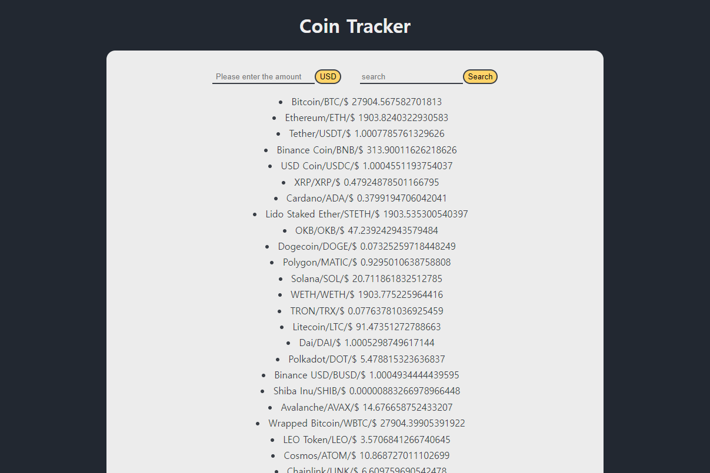

# coin-tracker

Nomad Coder의 ‘ReactJS로 영화 웹 서비스 만들기’ 강의 속 간단한 앱 만들기 중 전세계에 있는 코인의 종류와 정보를 알 수 있는 open API를 통해 코인의 이름과 symbol, 가격(달러)를 목록으로 표시했습니다.

## 기능

- 사용자는 전세계의 코인들의 이름과 symbol,가격을 알 수 있습니다.
- 첫번째 input에 달러를 입력시 입력한 달러로 살 수 있는 코인의 양을 표시해줍니다.
- 대소문자 구별 없이 검색할 수 있습니다.

## 사용한 기술
- coinpaprika API
- React
- styled-component